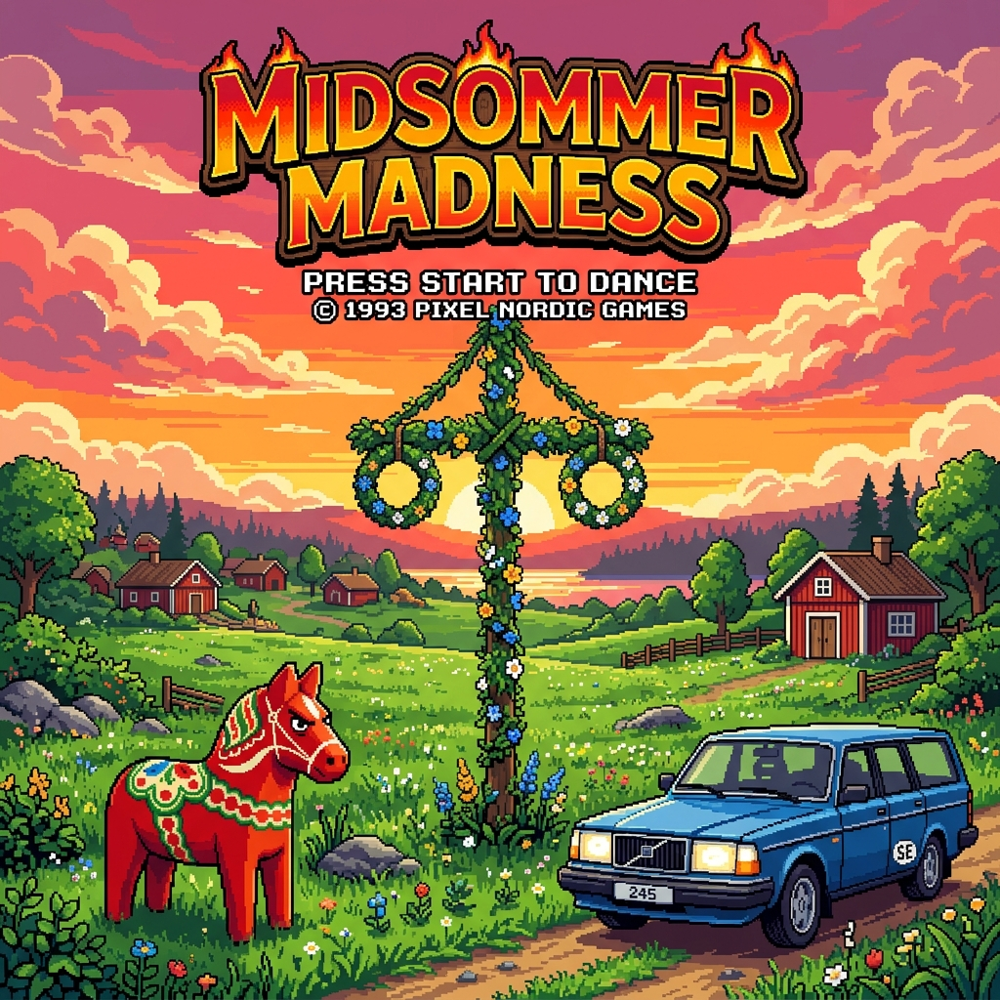
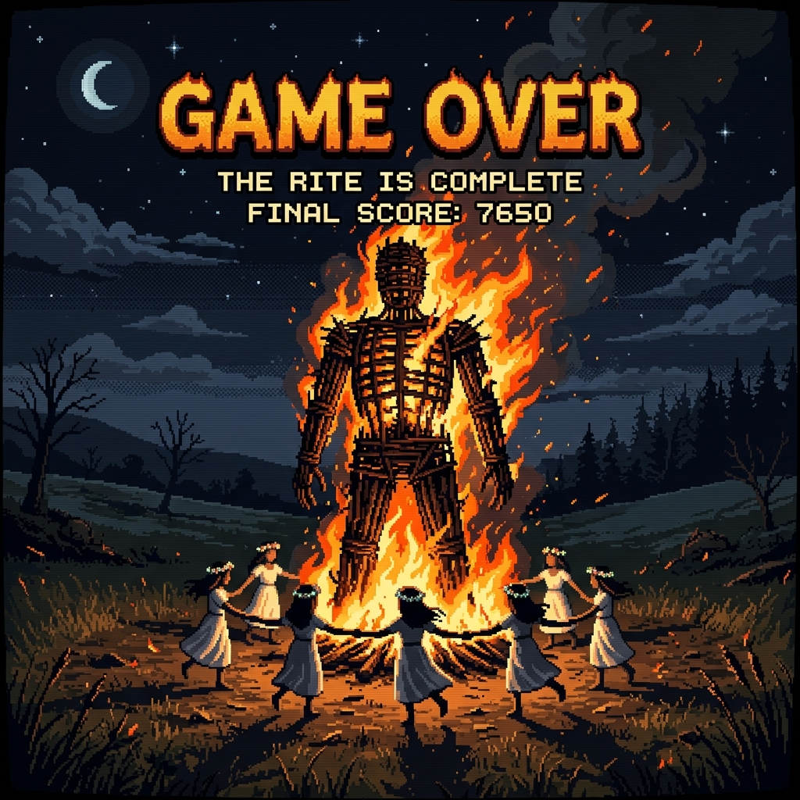
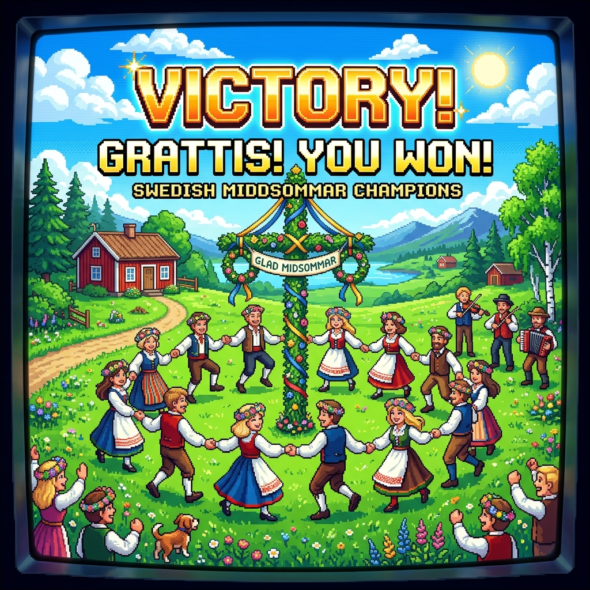

# Midsommer Madness 🇸🇪

Midsommer Madness is a Swedish-themed action retro arcade game inspired by *Redneck Rampage* and the Swedish Midsummer holiday. 

Help Sven race against the solar timer to reach the Maypole (*midsommarstång*) before sundown! If you fail, the solstice is lost, you trigger a meltdown, and you are sacrificed to the Wicker Man.

---

## 📸 Screen Gallery

| Title Screen | Game Over Screen | Victory Screen |
| :---: | :---: | :---: |
|  |  |  |

---

## 🎮 Level Sequence

The game features ten distinct thematic levels:
1. **IKEA Warehouse:** Battle crowded, flatpack-carrying shoppers who throw box projectiles at you.
2. **Systembolaget:** The state-owned liquor shop crowded with drunk Swedes stumbling and lobbing green beer bottles.
3. **Lördagsgodis:** Sugar rush Saturday! Dodge hyperactive, strung-out Swedish kids throwing sweet candy projectiles.
4. **The Swedish Pub:** Sing along with Frank Zappa fans singing "Bobby Brown" (shouting and firing glowing letters `B`, `O`, `B`, `B`, `Y`).
5. **Volvo Highway:** A survival lane-crossing level where boxy blue Volvo station wagons zoom across lanes at high speeds.
6. **Dalarna Forest:** Deep green woods where giant red wooden Dalarna Horses charge at Sven in sudden dash-bursts.
7. **Allemansrätten:** Swedish right to roam! Harvest wild cloudberries while dodging aggressive elk charging and stomping.
8. **Kvinnafängelset:** Escape the Swedish women's prison! Dodging strict guards throwing heavy metal handcuffs.
9. **Avicii Rave:** A dark neon rave under strobe lights. Dance through ravers wearing shades who throw glowing glowsticks.
10. **ABBA Disco:** The final level under glowing purple lights. Chrome ABBA Bots fire multi-directional pink disco laser spreads. Reach the Maypole in the center to save Midsummer!

---

## 🛠️ Combat & Mechanics

- **Rust-Powered WebAssembly Engine:** Game state calculations, 60Hz deterministic fixed-timestep physics, particle simulations, and collision detections (both circle and axis-aligned bounding box checks) are processed in real-time by a compiled Rust WebAssembly module to prevent GC pauses and guarantee smooth frame pacing.
- **Hockey Stick (Melee):** Left-click swings the stick in front of Sven towards the cursor, damaging and knocking back enemies. Alternatively, press **H** as a keyboard shortcut.
- **Surströmming Bomb (Ranged):** Right-click or Space throws a canned fermented herring that explodes, creating a lingering toxic green gas cloud that damages all enemies inside.
- **Swedish Power-Ups:**
  - **Köttbullar (Meatballs):** Restores 25 energy.
  - **Knäckebröd (Crispbread):** Grants a 4-second speed boost (+50% speed) and a yellow dotted forcefield shield (blocks 80% of damage).
- **Procedural Synthesizer (Web Audio API):** All game music and SFX are procedurally synthesized in real-time, adjusting BPM, scales, and motifs depending on the level (e.g. happy chiptunes, acoustic folk, heavy metal, EDM, and disco).
- **Screen Shake:** Dynamic impact feedback on hits and stomps.

---

## 🚀 How to Play Locally

1. Start the local server:
   ```bash
   make dev
   ```
   *Alternatively, run `npm run dev`.*
2. Open your browser and navigate to the port displayed in the console output.

---

## ⌨️ Controls

- **W, A, S, D** or **Arrow Keys** — Move Sven
- **Mouse Movement** — Aim
- **Left Click** or **H** — Swing Hockey Stick (Melee)
- **Right Click** or **Space** — Throw Surströmming Bomb (Ranged)

---

## 📱 Flutter App Wrapping & Firebase Integration

This project is wrapped in a full-screen, landscape-locked Flutter `WebViewWidget` that runs the web-based game. It features:
* **Firebase Cloud Leaderboard**: Real-time high-score sync with Cloud Firestore.
* **Firebase Analytics**: Tracks game events (e.g., state transitions, victory, game over, and scores) directly from the JavaScript layer.
* **Firebase Crashlytics**: Collects fatal and non-fatal errors from the Flutter native app, as well as unhandled JavaScript exceptions from the WebView game loop.
* **Firebase Performance Monitoring**: Employs custom traces (`get_leaderboard_scores` and `save_leaderboard_score`) to track the latency of leaderboard fetch and submission operations.
* **Offline Caching Fallback**: Seamless fallback to local `SharedPreferences` cache (on mobile) or `localStorage` (on web) if offline or if Firebase credentials are unconfigured.
* **Interactive High-Score Submission**: A custom Name Input Form appears automatically upon Victory or Game Over if the player qualifies for the Top 5 leaderboard.
* **Mobile Touch Controls**: A virtual joystick zone and custom action buttons on mobile touch layouts.
* **Aspect-Ratio Scaling**: Automatic resizing of the HTML5 canvas to fit mobile screen resolutions.
* **Sticky Full-Screen Immersive Mode**: Hides system status bars and navigation menus using Flutter's native window/system chrome configurations.
* **Bypassed Audio Gesture Constraints**: Autoplay is enabled on the WebView so audio triggers without needing explicit user touch gestures.

### 🔌 JavaScript-to-Native Bridge (LeaderboardChannel)

Communication between the WebView (`assets/game.js`) and Flutter (`lib/main.dart`) is facilitated via a JavaScript Channel named `LeaderboardChannel`. Message payloads are sent as JSON strings with the following formats:

1. **Fetch Leaderboard Scores**
   ```json
   { "type": "getScores" }
   ```
   *Native action: Fetches current high scores, saves to local cache, and calls `window.onScoresLoaded(scoresJson)` on completion.*

2. **Save Player Score**
   ```json
   {
     "type": "saveScore",
     "name": "Sven",
     "score": 15000
   }
   ```
   *Native action: Commits the player record to Firestore and records a score post to Analytics.*

3. **Log Analytics Event**
   ```json
   {
     "type": "logEvent",
     "name": "level_start",
     "parameters": {
       "level_id": "ikea_warehouse",
       "level_title": "1. IKEA Warehouse"
     }
   }
   ```
   *Native action: Routes custom gameplay metrics directly to Firebase Analytics.*

4. **Record JavaScript Exception**
   ```json
   {
     "type": "recordError",
     "message": "TypeError: Cannot read properties of undefined (at game.js:123:45)",
     "stack": "TypeError: Cannot read properties of undefined\n  at Game.update (game.js:123:45)"
   }
   ```
   *Native action: Submits WebView exceptions to Firebase Crashlytics as non-fatal runtime issues.*

### 📂 Project Structure & Architecture

* **Rust / WebAssembly Physics Engine**:
  - [game-wasm/src/lib.rs](file:///home/xbill/midsommer-wasm/game-wasm/src/lib.rs): Rust implementation of game physics, particle simulations, collision detection, and entity management.
  - [game-wasm/Cargo.toml](file:///home/xbill/midsommer-wasm/game-wasm/Cargo.toml): Cargo package configuration, highly optimized for size/speed.
  - [assets/game_physics.wasm](file:///home/xbill/midsommer-wasm/assets/game_physics.wasm): Compiled WebAssembly engine binary.
  - [assets/wasm_binary.js](file:///home/xbill/midsommer-wasm/assets/wasm_binary.js): Automatically generated JavaScript file containing `WASM_BASE64` for seamless, zero-config inlined assembly loading.

* **Web Assets & Game Frontend**:
  - [index.html](file:///home/xbill/midsommer-wasm/assets/index.html): Entry point, mobile-first touch layout canvas, retro HUD, and name entry interfaces.
  - [game.js](file:///home/xbill/midsommer-wasm/assets/game.js): Canvas rendering, user inputs, procedural Web Audio synth scheduler, and coordination with the Rust/WASM library.
  - [index.css](file:///home/xbill/midsommer-wasm/assets/index.css): Responsive layout, retro Swedish color scheme, animations, and touch screen sizing.

* **Flutter Wrapper App**:
  - [main.dart](file:///home/xbill/midsommer-wasm/lib/main.dart): Sets up a full-screen, landscape-locked `WebViewWidget` that runs the web-based game, registers the `LeaderboardChannel` JavaScript-to-Native bridge, initializes Firebase services, and coordinates local storage fallbacks.
  - [pubspec.yaml](file:///home/xbill/midsommer-wasm/pubspec.yaml): Registers assets and Flutter dependencies (`webview_flutter`, `firebase_core`, `cloud_firestore`, `shared_preferences`, etc.).

---

### 🛠️ Building and Deploying via CLI (Makefile)

We provide an extensive, automated [Makefile](file:///home/xbill/midsommer-wasm/Makefile) to run, compile, test, and deploy the entire hybrid stack:

| Command | Action / Description |
| :--- | :--- |
| `make dev` / `make run` | Compiles Rust WASM (`make build-wasm`) and boots up a local lightweight web server to play the game in any browser. |
| `make build-wasm` | Compiles the Rust physics engine targeting `wasm32-unknown-unknown` and auto-packages it into `assets/wasm_binary.js`. |
| `make test` | Runs the full Flutter unit and widget testing suite. |
| `make build-apk` | Compiles the Rust WASM and builds a debug Android APK. |
| `make build-ios` | Compiles the Rust WASM and builds an iOS application package without signing. |
| `make install-apk` | Deploys and installs the compiled debug APK onto a connected Android device or emulator. |
| `make logcat` | Streams real-time application logs from any connected mobile devices. |
| `make clean` | Cleans Flutter build directories, compiler caches, and intermediate outputs. |
| `make firebase-emulators` | Launches the local Firebase Emulator Suite (Firestore, Hosting, etc.) for testing without live database impact. |
| `make deploy` | Deploys static assets in the `assets/` directory directly to live production Firebase Hosting. |
| `make deploy-preview`| Deploys a temporary testing preview channel (valid for 7 days) to Firebase Hosting. |
| `make firebase-status` | Lists configured Firebase projects and active deployment targets. |
| `make deploy-rules` | Compiles and deploys Firestore database security rules. |
| `make firebase-logs` | Queries the last 20 runtime/audit cloud logs from the GCP Logging system. |

---

## 🌐 GitHub Repository & CI/CD Deployment

This project is hosted on GitHub at [xbill9/midsommer-wasm](https://github.com/xbill9/midsommer-wasm).

Automated deployment is configured via GitHub Actions:
* **Pull Request Preview**: Every PR targeting the `master` branch triggers `.github/workflows/firebase-hosting-pull-request.yml`, which deploys a temporary preview channel of the game for testing.
* **Production Deploy**: Pushing or merging to the `master` branch triggers `.github/workflows/firebase-hosting-merge.yml`, which automatically deploys the latest version to the live Firebase Hosting site.
